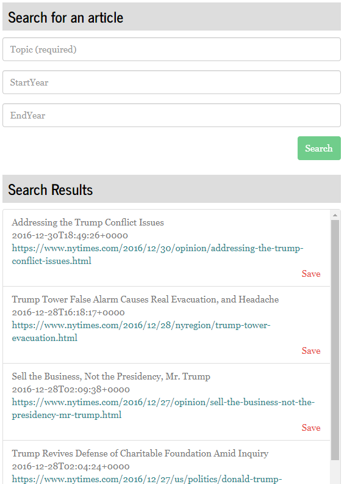
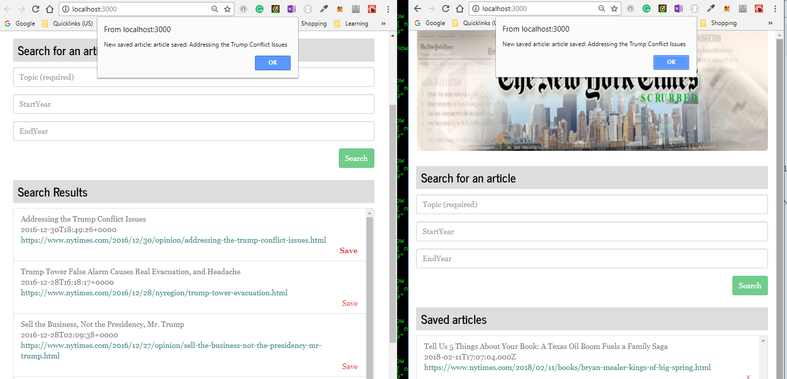

# NYT Article Scrubber
## Week 20 Homework - Full stack single page application with MongoDB, Express, React and Node (MERN) and Socket.io.
.
View project on heroku at https://sleepy-refuge-45848.herokuapp.com/
.  
.  
## Introduction & Instructions.

### Initial page ###

NYT scrubber enables multiple users to query the New york Times API for news articles past and present and to save them to a common database for all users to see. In addition all users are notified when any one user saves a new article to the database.

On startup the application automatically loads the saved articles and displays them in the right hand pane. A search panel in the left hand pane allows users to search for an article using a search term and narrow the search to a specific timeframe using the StartYear and EndYear fields

.   
.   

Search results (limited to the most relevant 5) appear in a panel below the search panel, with headline, date and link to the complete article. Clicking the link opens a new tab where the complete article can be read. 

.   
.   

### Saving articles ###

Clicking 'save' next to an article of interest in the results panel will do two things:

1. the article will be saved to the database (and will appear in the saved articles panel)
2. all users of the application (in different browsers) will be alerted to the new saved article, so that they can review it promptly

.   
.   

Articles can also be deleted from the saved articles panel by clicking the red cross next to the article to be deleted. 

### The application uses: ###
  
1. React
2. Node.js
3. Express.js
4. MongoDB 
5. Mongoose
6. Socket.io

and demonstrates:
  
5. model-view-controller organisation
6. use of socket.io for messenging between users
7. use of a nosql, document oriented database (MongoDB)
8. deployment to heroku
 
### NPM Packages ###

1. npm install express 
2. npm install mongo
3. npm install body-parser
4. npm install react
5. npm install mongoose
6. npm install axios
7. npm install socket-io
8. npm install socket.io-client7

# Copyright

Mathew Hall (C) 2018. All Rights Reserved.

